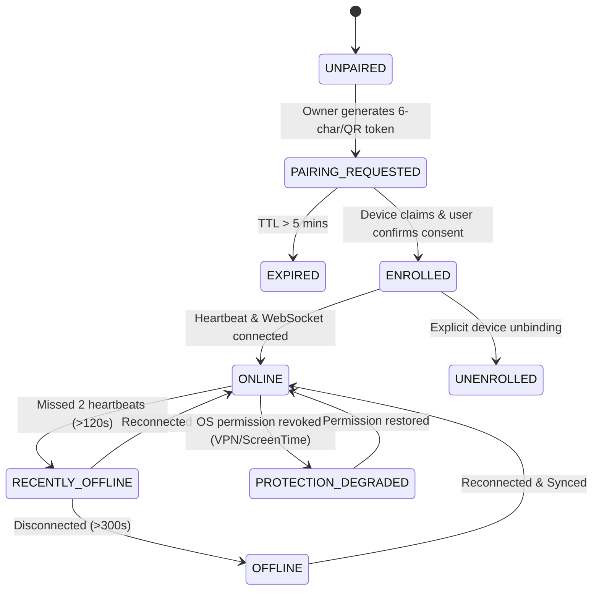

# FOCUSGUARD — Multi-Device Platform Systems Architecture

> **Tagline**: *"One policy. Every protected device."*  
> **Course**: CSE 3200 Software Development  
> **Domain**: Multi-Device Attention Management, Distributed Policy Enforcement & Secure Consent-Based Enrollment

---

## 1. System Overview & Core Philosophy

FocusGuard is a **consent-based, policy-driven, multi-device attention enforcement platform**. It connects multiple user devices (macOS laptops, Android smartphones, tablets) into a synchronized, tamper-resistant attention boundary.

```
+-----------------------------------------------------------------------------------+
|                            ACCOUNT OWNER / CONTROL CENTER                         |
|  - Define Policies (App/Website/Category budgets)                                 |
|  - Manage Scoped Devices (Personal vs. Managed Devices)                           |
|  - Launch Remote Focus Sessions                                                   |
|  - Real-Time Fleet Health & Adherence Telemetry                                   |
+-----------------------------------------------------------------------------------+
                                         │
                        HTTPS REST & WebSocket (WSS)
                                         │
                                         ▼
+-----------------------------------------------------------------------------------+
|                        FOCUSGUARD CLOUD & POLICY ENGINE                           |
|  - Policy Authority & Global Policy Versioning (v1, v2, ... vN)                   |
|  - One-Time Secure Enrollment Token Generator (6-char code / QR, 5-min TTL)       |
|  - Cryptographic Remote Command Dispatcher (Idempotent, Time-bounded)             |
|  - Shared Cross-Device Attention Aggregator & Deduplication                       |
|  - Persistent Audit Ledger & RBAC Authorization                                   |
+-----------------------------------------------------------------------------------+
                         │                                 │
           Push Scoped Policies & Commands   Push Scoped Policies & Commands
                         │                                 │
                         ▼                                 ▼
+------------------------------------+  +------------------------------------+
|    ENROLLED macOS NODE (Swift)     |  |    ENROLLED Android NODE (Kotlin)  |
|  - Local Policy Engine             |  |  - Local Policy Engine             |
|  - FamilyControls Authorization    |  |  - VpnService DNS Filter Engine   |
|  - ManagedSettingsStore Shields    |  |  - DomainPolicyCache & Categories  |
|  - DeviceActivity Telemetry        |  |  - UsageStatsManager Aggregator    |
|  - Offline Delta Queue             |  |  - Offline Delta Queue             |
+------------------------------------+  +------------------------------------+
```

---

## 2. Secure Device Enrollment Protocol

Enrollment operates strictly on **explicit user consent** and cryptographic device authentication.

### Enrollment Flow:
1. **Owner Initiation**: Owner clicks *"Add Device"* on Web/Mac control center.
   - Server generates a cryptographically random 6-character pairing code (e.g. `FG-7892`) and signed QR payload with a strict 5-minute Time-To-Live (TTL).
2. **Device Claim**: Managed device installs FocusGuard, chooses *"Join Account"*, enters code or scans QR.
3. **Consent Presentation**: Device UI renders explicit disclosure:
   - Target Account Name & Owner ID
   - Requested permissions (Usage Access, VPN Service / Screen Time)
   - Scope of policies that will be enforced
   - Clear declaration: *"This device will be protected by FocusGuard."*
4. **Device Confirmation**: User explicitly taps *"Accept & Enroll"*.
5. **Token Issuance**: Server verifies pairing token, binds unique `deviceID`, issues device-specific JWT credentials with role `DEVICE`, and updates status to `ENROLLED`.

---

## 3. Device State Machine



---

## 4. Distributed Policy Versioning & Offline Autonomy

- **Server Authority**: The server is the authoritative source for policy definitions and increments `policyVersion` on every CRUD modification.
- **Device Autonomy**: The device is the **enforcement authority**. When offline, the device continues enforcing its local cached `lastAppliedVersion`. It never disables protections when the network is unavailable.
- **Sync Reconciliation**: Upon network reconnection, the client presents `lastAppliedVersion`. If `serverVersion > clientVersion`, the client downloads the delta, applies local shields, and reports `APPLIED`.

---

## 5. Cryptographic Remote Command Protocol

Remote commands (such as starting a remote focus session or updating an emergency policy) are strictly bounded to prevent abuse:

```json
{
  "commandId": "9b1deb4d-3b7d-4bad-9bdd-2b0d7b3dcb6d",
  "deviceId": "a0eebc99-9c0b-4ef8-bb6d-6bb9bd380a11",
  "issuedBy": "00000000-0000-0000-0000-000000000001",
  "commandType": "REMOTE_FOCUS_START",
  "policyVersion": 52,
  "issuedAt": 1786728000,
  "expiresAt": 1786731600,
  "payload": {
    "durationMinutes": 45,
    "blockedCategories": ["SOCIAL", "VIDEO", "GAMING"],
    "blockedDomains": ["youtube.com", "instagram.com", "reddit.com"],
    "allowedDomains": ["canvas.university.edu", "messages.google.com"]
  }
}
```

- **Idempotency**: Duplicate command IDs received over retry or replayed network packets are executed exactly once.
- **Expiration**: Any command received past `expiresAt` is rejected immediately.
- **Safety Boundaries**: Commands are strictly restricted to the FocusGuard domain (`POLICY_UPDATE`, `POLICY_DELETE`, `FOCUS_START`, `FOCUS_END`, `SYNC_REQUEST`). Shell execution or arbitrary code execution is strictly impossible.

---

## 6. Safe Domain & Subdomain Matching Algorithm

FocusGuard enforces website blocking via a deterministic hierarchical domain matcher:

1. **Normalization**:
   - Lowercase string
   - Strip leading/trailing whitespace and trailing dots
   - Strip leading protocol (`http://`, `https://`) and path segments
   - Strip `www.` and `m.` prefixes for standard target comparison
2. **Matching Rule**:
   - Exact Match: `candidate == target` (e.g. `youtube.com == youtube.com`)
   - Subdomain Match: `candidate.endsWith("." + target)` (e.g. `music.youtube.com` matches `youtube.com`)
   - Negative Safety: `notyoutube.com` does **NOT** match `youtube.com`.

---

## 7. Policy Precedence & Conflict Resolution Hierarchy

When multiple policies, categories, and exceptions apply to an activity, the engine evaluates rules in strict order:

```
1. SYSTEM SAFETY & EMERGENCY SERVICES (Always ALLOW: 911, Phone, System Settings)
                       ↓
2. EXPLICIT ALLOWLIST (e.g. canvas.university.edu, messenger.com)
                       ↓
3. ACTIVE EMERGENCY POLICY / REMOTE FOCUS LOCKOUT (Instant BLOCK)
                       ↓
4. EXPLICIT DOMAIN / APP BLOCKLIST (e.g. youtube.com > 30m)
                       ↓
5. CATEGORY POLICY (e.g. SOCIAL MEDIA > 45m)
                       ↓
6. DEFAULT STATE (ALLOW)
```

---

## 8. Database Schema Extensions

```sql
-- 1. Enrollment Tokens
CREATE TABLE enrollment_tokens (
    id TEXT PRIMARY KEY,
    user_id TEXT NOT NULL REFERENCES users(id) ON DELETE CASCADE,
    pairing_code VARCHAR(10) UNIQUE NOT NULL,
    device_name VARCHAR(100) NOT NULL,
    target_role VARCHAR(20) NOT NULL DEFAULT 'MANAGED_USER',
    expires_at DATETIME NOT NULL,
    is_claimed INTEGER NOT NULL DEFAULT 0,
    created_at DATETIME NOT NULL DEFAULT CURRENT_TIMESTAMP
);

-- 2. Device Scope & Role
ALTER TABLE devices ADD COLUMN role VARCHAR(20) NOT NULL DEFAULT 'PERSONAL';
ALTER TABLE devices ADD COLUMN is_managed INTEGER NOT NULL DEFAULT 0;
ALTER TABLE devices ADD COLUMN policy_version INTEGER NOT NULL DEFAULT 1;

-- 3. Policy Device Assignments (Scoped Policies)
CREATE TABLE policy_assignments (
    policy_id TEXT NOT NULL REFERENCES policies(id) ON DELETE CASCADE,
    device_id TEXT NOT NULL REFERENCES devices(id) ON DELETE CASCADE,
    PRIMARY KEY (policy_id, device_id)
);

-- 4. Remote Commands Ledger
CREATE TABLE remote_commands (
    id TEXT PRIMARY KEY,
    device_id TEXT NOT NULL REFERENCES devices(id) ON DELETE CASCADE,
    issued_by TEXT NOT NULL REFERENCES users(id) ON DELETE CASCADE,
    command_type VARCHAR(50) NOT NULL,
    payload TEXT NOT NULL,
    issued_at DATETIME NOT NULL DEFAULT CURRENT_TIMESTAMP,
    expires_at DATETIME NOT NULL,
    status VARCHAR(20) NOT NULL DEFAULT 'PENDING'
);

-- 5. Audit Log Ledger
CREATE TABLE audit_logs (
    id TEXT PRIMARY KEY,
    user_id TEXT NOT NULL REFERENCES users(id) ON DELETE CASCADE,
    device_id TEXT REFERENCES devices(id) ON DELETE SET NULL,
    action VARCHAR(100) NOT NULL,
    details TEXT,
    timestamp DATETIME NOT NULL DEFAULT CURRENT_TIMESTAMP
);
```

---

## 9. Jira Epics Breakdown (FG-MD-01 through FG-MD-10)

| Epic Key | Epic Summary | Phase |
|---|---|---|
| `FG-MD-01` | **Device Enrollment & Pairing Subsystem**: 6-char pairing token & QR generation | Phase 1 |
| `FG-MD-02` | **Device Identity & RBAC Engine**: Personal vs Managed Device roles | Phase 2 |
| `FG-MD-03` | **Scoped Remote Policy Builder**: Target specific enrolled devices | Phase 3 |
| `FG-MD-04` | **Policy Versioning & Delta Sync**: Server-authoritative distributed sync | Phase 4 |
| `FG-MD-05` | **Android Network Engine**: RFC 1035 DNS Sinkhole & Category provider | Phase 5 |
| `FG-MD-06` | **macOS Screen Time Subsystem**: ManagedSettingsStore & FamilyControls | Phase 6 |
| `FG-MD-07` | **Remote Focus Session Engine**: Cryptographic time-bounded commands | Phase 7 |
| `FG-MD-08` | **Security & Anti-Tampering Engine**: Monotonic drift & replay protection | Phase 8 |
| `FG-MD-09` | **Privacy & Audit Logging Ledger**: Minimal metadata enforcement | Phase 9 |
| `FG-MD-10` | **Owner Control Center & Managed UI**: Full-fleet dashboard & Lockout | Phase 10 |
