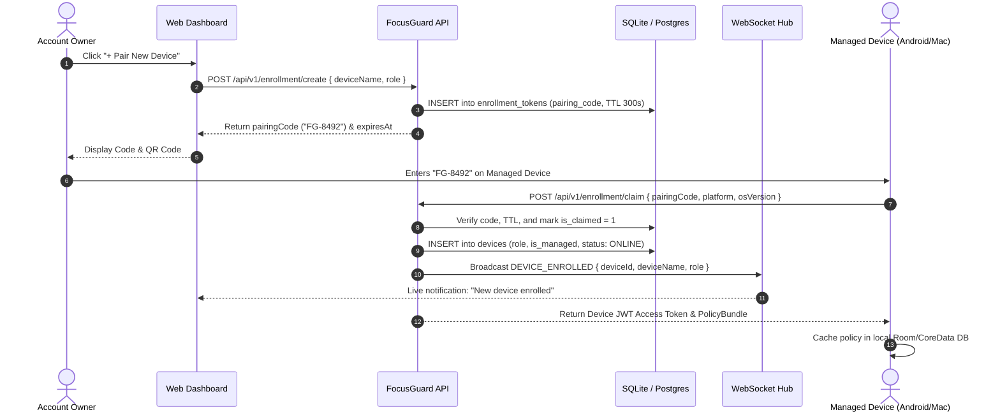

# Consent-Based Device Enrollment Architecture

FocusGuard replaces hidden MDM installation profiles with a **transparent, consent-driven cryptographic enrollment protocol**.

---

## 1. Enrollment Security Requirements

1. **Explicit Consent**: A device can only be bound to an account if an operator physically enters the ephemeral pairing code on that device.
2. **Short-Lived Cryptographic Tokens**: Pairing codes are 6 alphanumeric characters prefixed by `FG-` (e.g. `FG-8492QW`), generated via secure random bytes (`crypto/rand`), and expire strictly after 300 seconds (5 minutes).
3. **Single-Claim Guarantee**: Once a pairing code is claimed, `is_claimed` is set to `1` in an atomic SQL transaction to prevent race conditions and replay attacks.

---

## 2. Protocol Sequence Diagram

